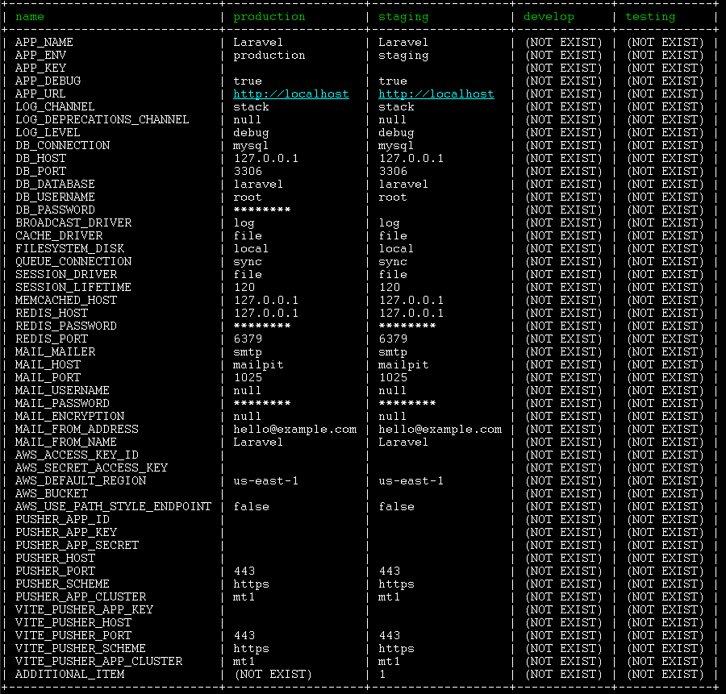

# laravel-env-documentator

Laravelの環境変数に関する開発者向けドキュメントを生成する機能を提供するパッケージ

# 概要

このパッケージは、暗号化された環境変数設定ファイルを復号し、整理して表示するartisanコマンド env:documentator を提供する。

- デプロイ先名称を列、.envに記載された設定項目名を行とする二次元表を出力する。
- デプロイ先が複数存在するプロジェクトにおいて、各環境ごとの設定値を管理、可視化する目的で作成した。
- このパッケージは、ローカル開発環境において開発者が利用することを想定しているため、devオプションでインストールすることを推奨する

## 実行例



## 主な機能

- 結果表示時に、パスワード等セキュリティ上重要な項目の具体的な値を隠す SecretFilter
- 各設定値に対してメタ情報を追加して出力する -m オプション

## このパッケージの提供していない機能

- 暗号化されていない平文の環境変数設定ファイル内容の表示

# インストール

(編集中)

# 設定

## デフォルト設定

デフォルトの設定、設定値に対するバリデーション等については [resources/env-documentator.php](./resources/env-documentator.php) を参照。

## 暗号化キー

復号に利用する暗号化キーを変更する場合、環境変数 ENV_DOCUMENTATOR_DEFAULT_KEY を設定する。

## 設定のカスタマイズ

デプロイ先毎に暗号化キー、暗号化方式が異なる場合や、メタ情報を追加したい場合など、詳細にカスタマイズする必要がある場合は、設定ファイルのpublishを行い、publishされた設定ファイルを編集する。

```shell
php artisan vendor:publish --provider=GitBalocco\\LaravelEnvDocumentator\\ServiceProvider 
```

# 実行

## 実行

~~~
php artisan env:documentator
~~~

## オプション

~~~
php artisan env:documentator -h
~~~
